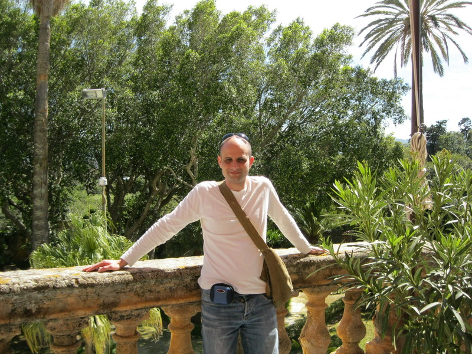



{::options parse_block_html="true" /}

{: .span5 .image-polaroid .thumbnail}

Benvenuti nella mia pagina personale.

Mi chiamo Leonardo Fontana, sono un laureando in Ingegneria Informatica presso l'Università degli Studi di Palermo.
Da sempre appassionato di IT ho avuto le prime esperienze all'età di 10 anni con un Commodore 64. Da allora non ho più smesso di amare questo mondo, in continua evoluzione come me. In particolare da quando ho cominciato ad usare Linux ho iniziato ad approfondire le tematiche su internet ed il web in particolare nell'ambito sever e website.

Le mie esperienze lavorative, come si evince dal portfolio, sono tutte orientate alla realizzazione di siti internet di varia natura. Attraverso di esse ho imparato ad utilizzare le piattaforme Wordpress e Joomla, anche se il mio sogno nel cassetto rimane sempre la gestione dei sistemi informativi.
Potete trovarmi anche su [Twitter](https://twitter.com/tetsuo2501){:target="_blank"}, [Instagram](http://instagram.com/leonardofontana){:target="_blank"} e [Google Plus](https://plus.google.com/+LeonardoFontana/){:target="_blank"}

Per domande e chiarimenti potete usare il form nella pagina [contattami](\contattaci.html).

Attraverso i miei studi e le mie esperienze ho acquisito conoscenze di:

* C
* C++
* PHP
* CSS
* HTML
* SQL
* Java
* JavaScript aka ECMA Script
* Dart

